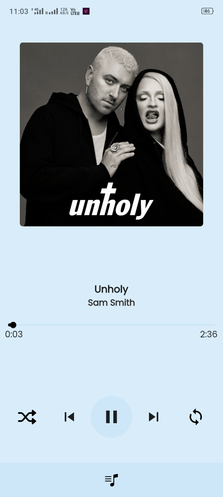
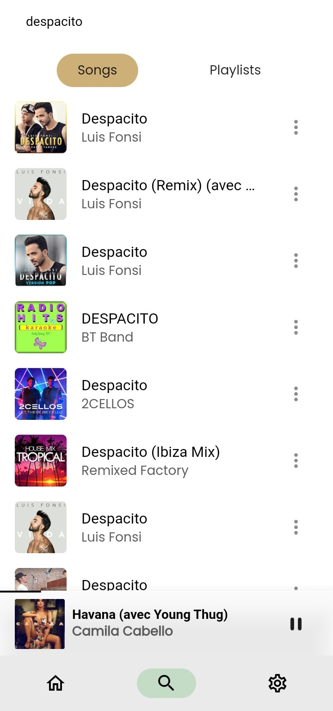
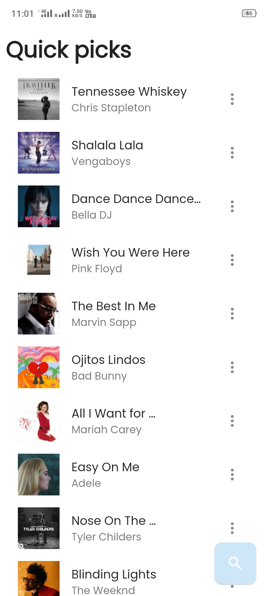
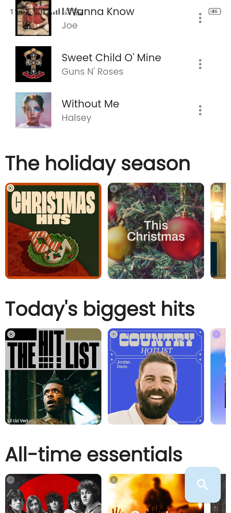

    
    <h1>Vibe Music</h1>
    
A Flutter application for streaming music from YouTube Music

---

  
  
  

    
  
  
  

## Features
- Play (almost) any song or video from YouTube Music
- Background playback
- Search for songs and playlists
- Reorder songs in playlist or queue
- Dynamic theme
- Persistent queue
- ...

## Installation

## Disclaimer
This project and its contents are not affiliated with, funded, authorized, endorsed by, or in any way associated with YouTube, Google LLC or any of its affiliates and subsidiaries.
Any trademark, service mark, trade name, or other intellectual property rights used in this project are owned by the respective owners.
