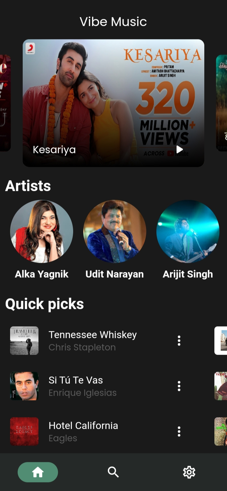
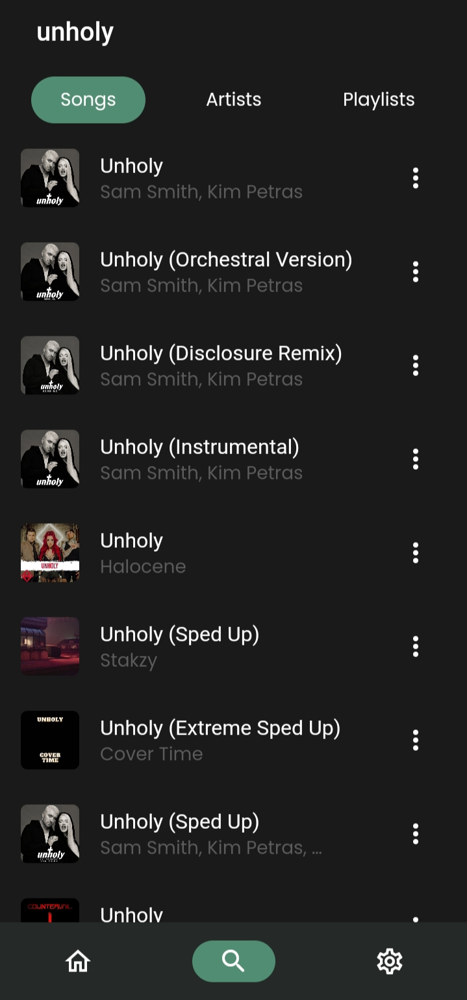
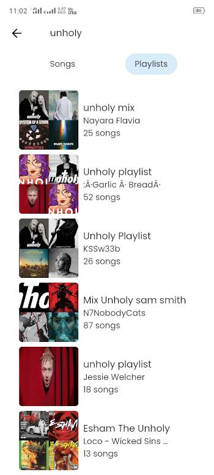
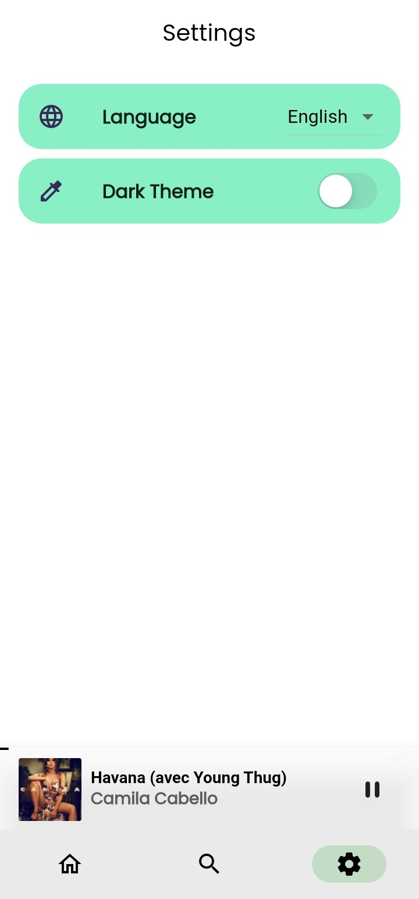
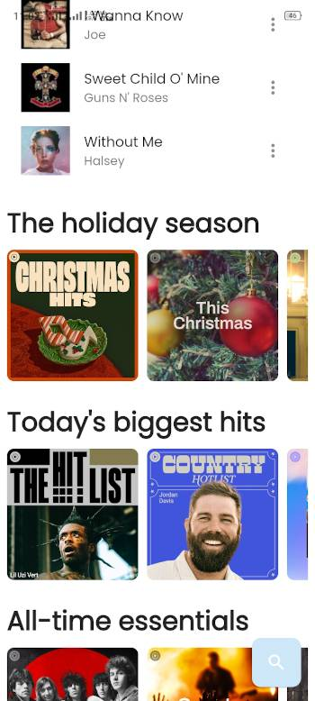
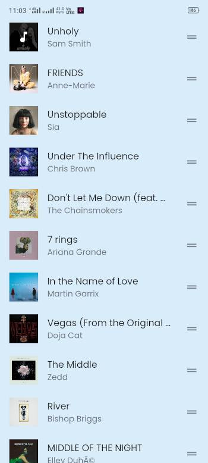

    
    <h1>Gyawun (Formerly Vibe Music)</h1>
    
A Flutter application for streaming music from Jio Saavn and YouTube Music

    
    
    
    
    

## Beta versions will  be released only on telegram.

  
  
  

---

  
  
  

    
  
  
  

## Languages
You can add your favorite language by:-
1. Join Gyawun on [PoEditor](https://poeditor.com/join/project/pFSZW9Pux7)
2. Add your favorite Language.
3. Translate Your Language and download as .arb.
4. create a pull request.

## Features / TODO
- [x] Play (almost) any song with high quality from Jio Saavn and YouTube Music
- [x] Background playback
- [x] Search for Songs, Artists and Playlists
- [x] Reorder songs in playlist or queue
- [x] Dark Mode
- [x] Change Audio Quality
- [x] Material You colors
- [x] Dynamic theme support
- [x] Add to favorites
- [x] Change direction from right to left
- [x] Save history locally
- [x] Download songs locally
- [x] Playback Cache
- [x] support for other Music Providers(YouTube Music)
- [x] Multiple Language Support(Partially)
- [x] Save playlist
- [x] Equilizer and Loudness Enhancer
- [ ] Create Playlists

## Installation

## Contributing

Pull requests are welcome. For major changes, please open an issue first
to discuss what you would like to change.

Please make sure to update tests as appropriate.

## 👩‍💻👨‍💻 Our valuable Contributors

## Disclaimer
This project and its contents are not affiliated with, funded, authorized, endorsed by, or in any way associated with YouTube, Google LLC or any of its affiliates and subsidiaries.
Any trademark, service mark, trade name, or other intellectual property rights used in this project are owned by the respective owners.
